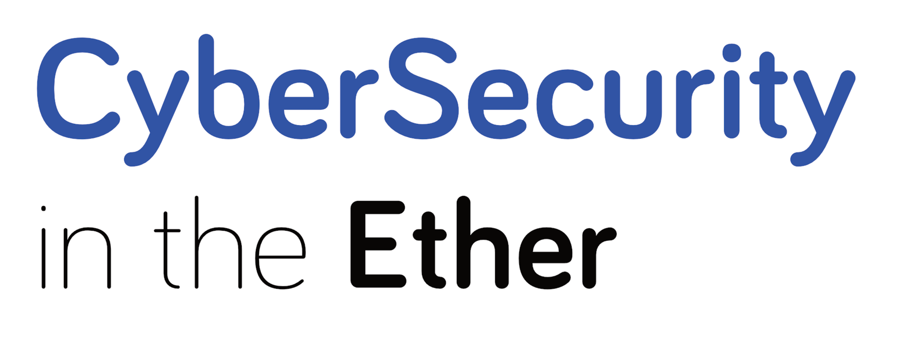

## What is CyberSecurity in the Ether?
A remote meetup bringing people together from across the globe to share and discuss all things Cyber Security.

## How the event works.
* Everyone joins remotely, once you are signed up a link will be shared with you for the event (one person per computer please, no screen sharing, sorry).
* Attendees adds a topic they wish to discuss.
* Everyone gets 3 votes on the topic's they are most interested in.
* The topics with the most votes get priority.
* Each topic gets 8 minutes of discussion time, at the end of the 8 minutes, we establish whether to continue with the topic or move on.

## Where is it?
The meetup is held online using [Webex](https://webex.com) which means it's wherever you are! There are 25 spaces available for each session and are booked through eventbrite.

## What do I need to join?
* A computer with access you can install webex on
* Decent internet connection to cope with a video call
* A webcam and microphone so everyone can see and hear you
* Quiet space and headphones so you can hear everyone
* A desire to learn and share

Take a look at the [remote meeting tips](meeting_tips.md) to learn more.

## The principles of in the Ether
We have a few principles to make the meetups as enjoyable an experience as possible:

*Remote first:* everyone should be remote, this makes a level playing field. We embrace the opportunities and uniqueness of being remote, it is not about just trying to replicate a physical meet-up.

*Intentional inclusivity:* being remote allows people to join that who would otherwise be unable. Either because of location, travel time and cost restrictions or a number of other reasons. Being inclusive also means making sure that everyone has a chance to speak and engage in the conversations.

*Respect and reciprocity:* this means listening to each other’s questions, ideas and opinions; sharing ideas, stories and guidance and taking part to make a great event.

## When is the next one?
Check to see if one has been announced on our [eventbrite page](https://www.eventbrite.co.uk/e/cybersecurity-in-the-ether-tickets-91784482859)

***

_“This event is using the in the Ether format, for more info or to find out how to run your own meet-up in the Ether please see intheether.xyz“_